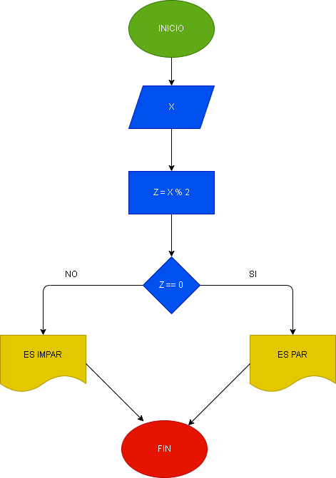

### PROGRAMA PARA IDENTIFICAR SI EL NUMERO DADO ES PAR O IMPAR

Se pide el ingreso de un numero el cual se almacena en la variable X
el cual por la operacion % si el residuo es 0 es par, si no es impar.

### Diagrama de flujo:
